# Analysis of Flight Operations/Dealys of the year 2015


``` About Dataset: Flights 
	I have used 4 sepearte but related .csv files for my analysis.
	flights.csv: This contains all the information of flight operations, delays, airports and airlines information for the year of 2015.
	airlines.csv: This contains the code and name of airlines present in flights.csv
	airports.csv: This contains code and name of airports present in flights.csv
	states.csv: This contains code and name of states present in airports.csv
	
	WeatherUndergound API: I have also fetched and stored the weather data for the year 2015 of the state experiencing most weather delays and used the data for one of my analysis.(Analysis-4)
``` 

	
## Analysis-1: Rating the airlines based on various factors.


*When we think of travelling the 1st question that comes to our mind is which is the best airlines. We can conclude an airline is best based on various factors like flight cancellation rate, flight speed, average arrival delay, flight volume(number of flight operations over other airlines) and average tax-in and tax-out times. Taxi-in time is the time duration elapsed between the aircraft's wheels touch on the ground and its gate arrival at the destination airport.*
*Taxi-out time is the time duration elapsed between departure from the origin airport gate and time that the aircraft's wheels leave the ground. Here we haven't considered departure delay as it depends mailny on the departure airport*
	
*We calculate the operated/scheduled rate, average flight speed(total distance/total time taken), flight volume(number of flights of that airline over flights of other airlines), average taxi-in and tax-out times for each airlines for the year 2015. Using this data, we score each airlines as operated/scheduled rate, average flight speed, flight volume is directly proprtional where as average arrival delay, average taxi-in and tax-out times are inversely proprtional to airline score. The higher the airline score the best the airlines is.*
	
The ouput of the analysis is plotted and written to csv file and can be found using these links:
	
Analysis-1 Code : [Analysis-1 Code](./Analysis/Analysis_1.ipynb)

Analysis-1 Plots: 
* 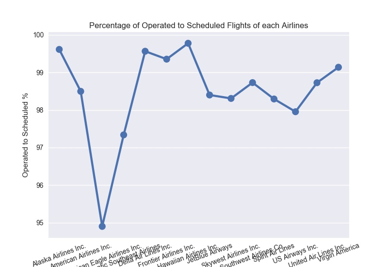
* 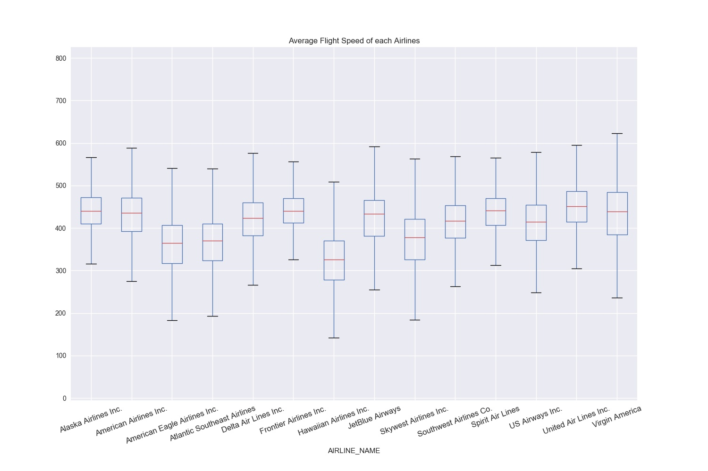
* _of_each_Airlines.jpeg)
* 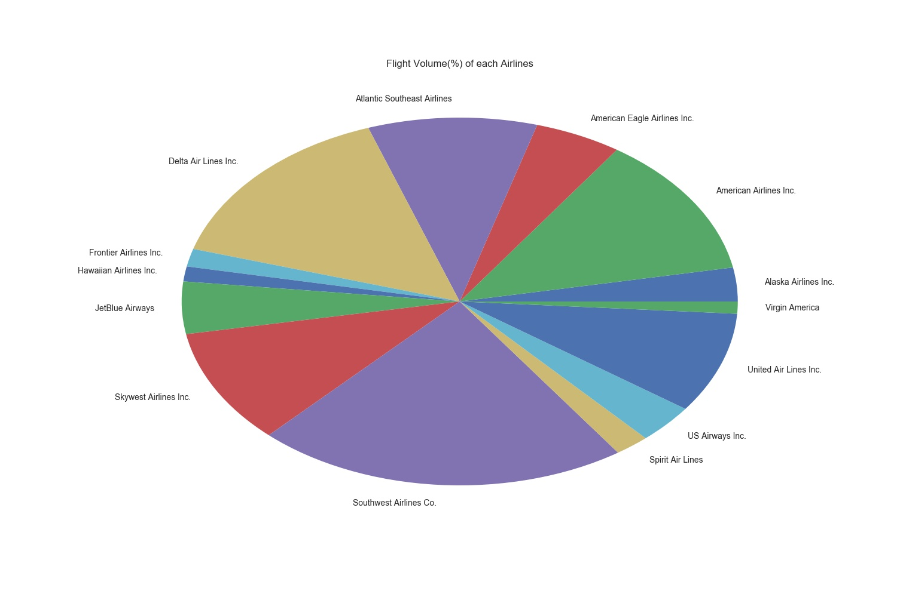
* _of_each_Airlines.jpeg)
* 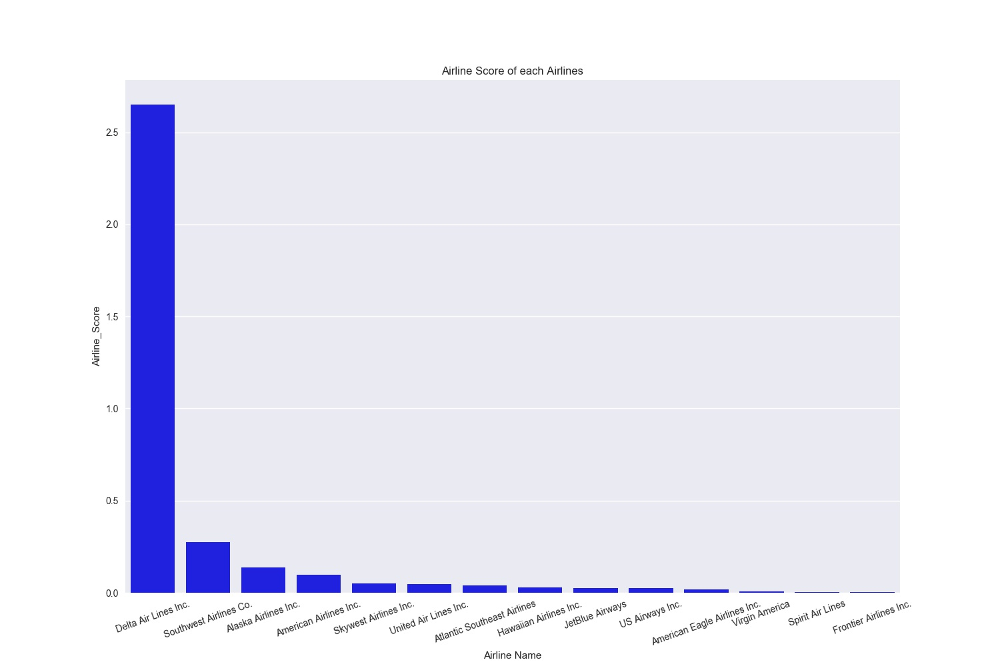 

Analysis-1 Output Files: 
    * [Ranking of Airlines](./Analysis/Analysis-1/Analysis_1_Ouput_Ranking_of_Airlines.csv)
    

	
> Conclusion:
**By this analysis, we can conclude that for the year 2015 'Delta Airlines' can be considered the best and 'Frontier Airlines' can be considered worst.
Now it's upon you to choose the airlines for you next travel!!!** 


## Analysis-2: 
--- 
* Trend of flight schedules/operations/cancellations over various months of 2015
* Identifying the least and most favorite destination states by each month of 2015

### Part-1:
In the 1st part, we identify the trend of flight schedule/operation/cancellation over all months of 2015. With this data we can get to know when the flight cancellations are more and plan to travel accordingly. We calculated the total flights scheduled, operated, cancelled by each month anf calculated the flight operation and cancellation percentage by each month. 

The ouput of the analysis is plotted and written to csv file and can be found using these links:

Analysis-2 Part-1 Plot: 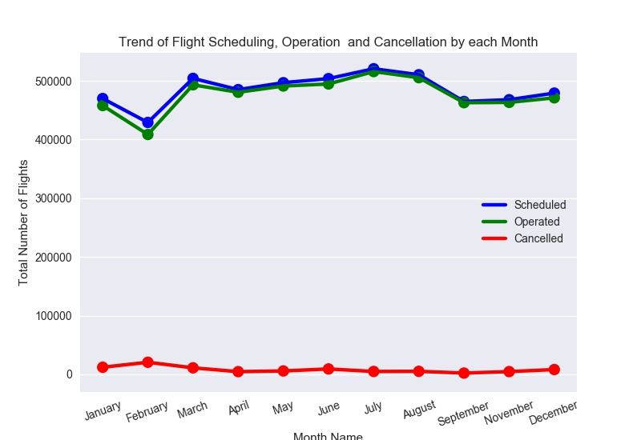

Analysis-2 Part-1 Output File: * [Trend of Flights Schedule, Operation and Cancellation by Monthes](./Analysis/Analysis-2/Analysis_2_Trend_of_Flights_Scheduled_Operated_Cancelled_by_Month.csv)


### Part-2:
In this part, we identified the most and least destination states based on the number of flights by each month of 2015. With this data, we can get to know which places to consider and avoid while planning for our vacation. Here we considered the least and most number of flights travelled to a destination state by each month and also identified from which origin state flights are operating. So that we can conclude which is most favourite destination and from which people are travelling to it more by each month and also the least favourite destination.

The ouput of the analysis is plotted and written to csv file and can be found using these links:

Analysis-2 Part-2 Output File: * [Least Favourite Destination State by month](./Analysis/Analysis-2/Analysis_2_Least_Favourite_Destination_State_by_Month.csv)
			       * [Most Favourite Destination State by month](./Analysis/Analysis-2/Analysis_2_Most_Favourite_Destination_State_by_Month.csv)
			       

The code for Part-1 and Part-2 can be found at this link:
Analysis-2 Code: [Analysis-2 Code](./Analysis/Analysis_2.ipynb)

> Conclusion:
**With the above analysis, we can conclude that most of the flights get cancellation during Febrauary and cancellation rate is considerably small in September.
We can also conclude that California has always been the most favorite destination throught out the year and Rhode Island is least favorite destination during January and Mississipi is the least favorite destination generally in 2015.** 

## Analysis-3:
---

*Which day of the week experiences most arrival delay and which hour of the day experience most arrival delay?*

*This analysis is done to understand on which day of the week flights would be experiencing most and least arrival delays and also which hour of the day on those most and least delay experiencing day of the week. I also performed analysis on generally which hour of the day experience most arrival delay. Here we calculate the average arrival delay for each day of the week. By the obtained data, we identified the most and least delay experiencing days of the week and the identified the hour of those days when delay is more and less. And also as the next part, I identified the most and delay experiencing hours of a day in general.*

This data will be useful in planning the time and day of travel for us in future.

The ouput of the analysis is plotted and written to csv file and can be found using these links:

Analysis-3 Code : [Analysis-3 Code](./Analysis/Analysis_3.ipynb)

Analysis-3 Plots:
*  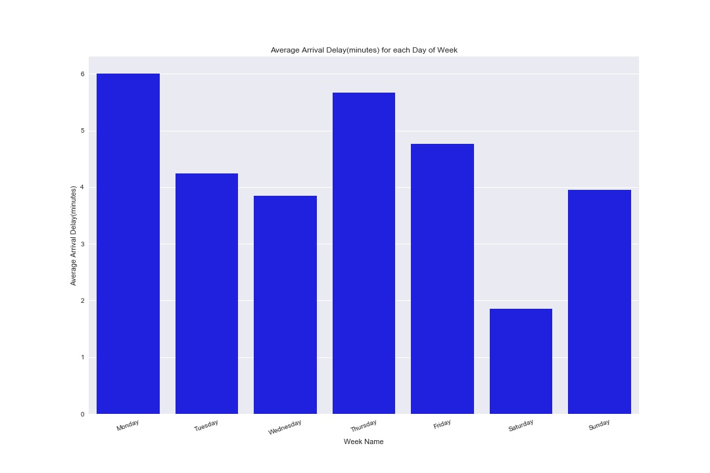
*  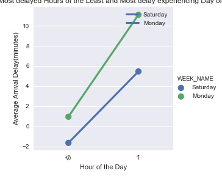
* 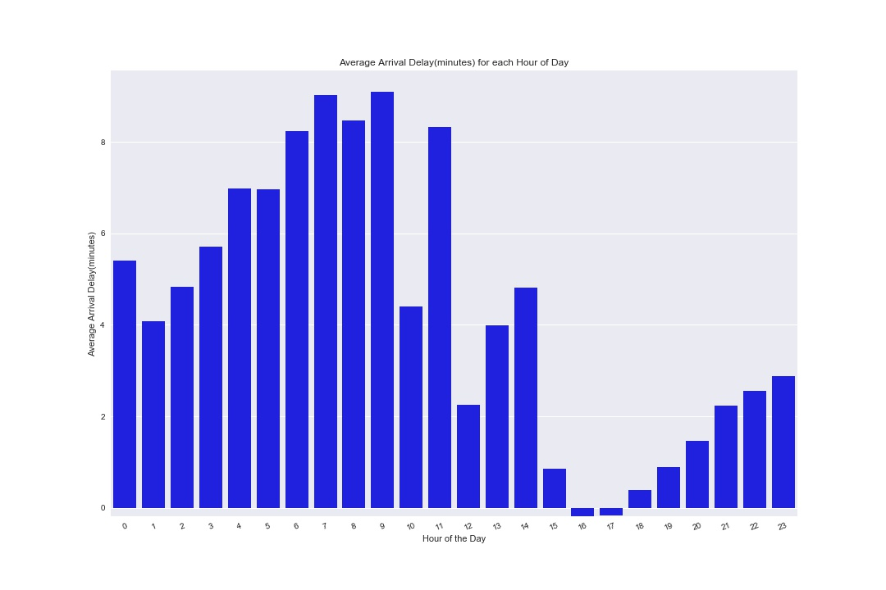


Analysis-3 Output Files: 
 * [Average Arrival Delay by Day of the Week](./Analysis/Analysis-3/Analysis_3_Average_Arrival_Delay_by_Day_of_the_Week.csv)
 * [Least and Most delay hours of the Least and Most delay experiencing by Day of the Week](./Analysis/Analysis-3/Analysis_3_Least_and_Most_delay_hours_of_the_Least_and_Most_delay_experiencing_Day_of_the_Week.csv)
 * [Average Arrival Delay by Hour of the Day](./Analysis/Analysis-3/Analysis_3_Average_Arrival_Delay_by_Hour_of_the_Day.csv)


> Conclusion:
**By the above analysis, I came to know that Monday experience maximum arrival delay where as Saturday experiences least. I also identified that onboth Saturday and Monday 16th hour(4 pm) experiences least and 7th hour(7 am) experiences maximum delay.
In general, 9th hour(9 am) experiences maximum and 16th hour(4 pm) experiences minimum delay.** 

Now, we can plan our travel accordingly.

## Analysis-4: 
---
* Contribution of each kind of dealy by each Airport State
* Analysing the reasons for weather delay in Airport state experiencing most weather delays

*With the flights data we know that arrival delay can be because of airline dealy, air system day, security dealy, late aircraft delay or weather delay. I identified the percentage of each of these delays for each airport state(arrival airport).*

*I was also concerned which state experiences most of the weather delays and for what reason. So, firstly I identified the states experiencing most weather delays. Using this I got to know the most weather delay experiencing state. Now I wanted to know for what weather reason that state is experiencing maximumweather delays over various months of an year. So I decided to collect the weather data for that state(top weathe delay experiencing state) for 2015 using Weather Underground API. After extracting the data for all days of 2015 for thats state, I calculated the average minimum and maximum teperatures and whether there was fog, tornado,thunder, snow by each month of the year. Using this data I concluded the reason for weather delays in that state over various months of 2015.*

The code for API data fetching and preparation is also with Analysis-4 code.

The ouput of the analysis is plotted and written to csv file and can be found using these links:

Analysis-4 Code : [Analysis-4 Code](./Analysis/Analysis_4.ipynb)

Analysis-4 Plots:
* 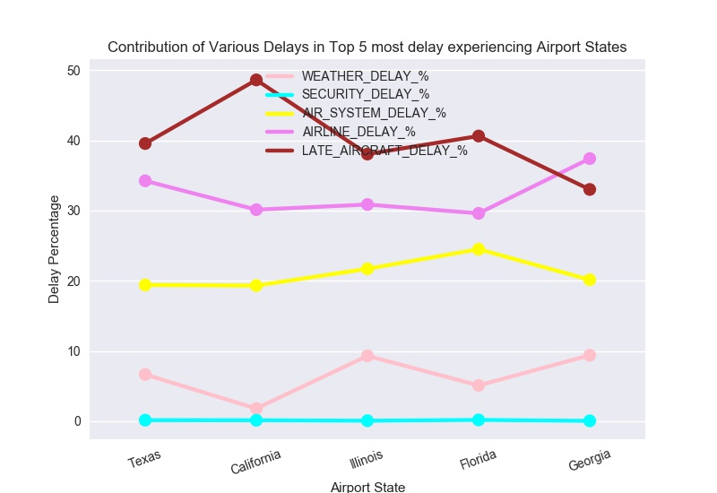
* 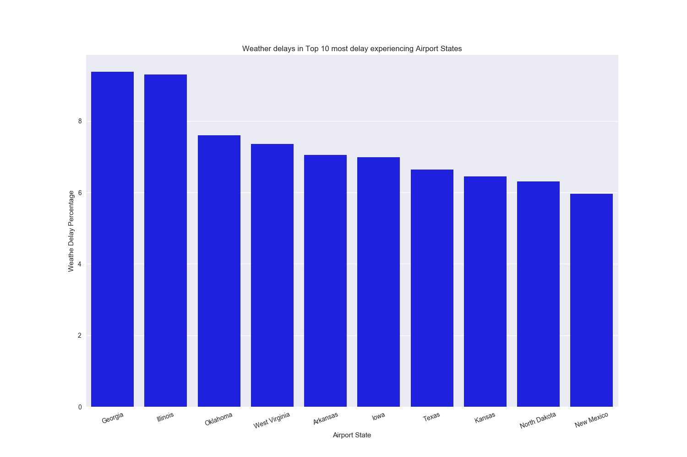
* 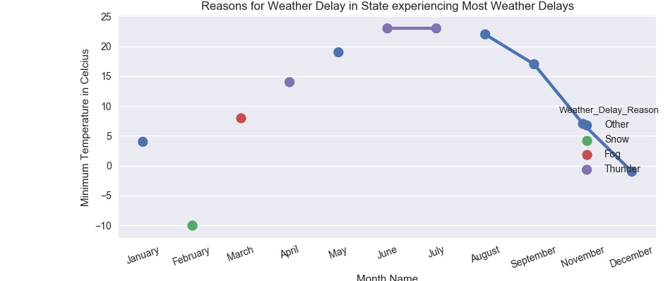

Analysis-4 Output Files: 
* [Contribution of Various Delays in Top 5 most delay experiencing States](./Analysis/Analysis-4/Analysis_4_Contribution_of_Various_Delays_in_Top_5_most_delay_experiencing_States.csv) 
* [Weather delay rates in_Top 10 Most delay experiencing States](./Analysis/Analysis-4/Analysis_4_Weather_delay_rates_in_Top_10_most_delay_experiencing_Airport_States.csv)
* [Reasons for Weather Delay in the State experiencing Most Weather Delays during various Months](./Analysis/Analysis-4/Analysis_4_Reasons_for_Weather_Delay_in_State_experiencing_Most_Weather_Delays.csv)


> Conclusion:
**With this analysis, we can conclude that air system dealy and late aircraft delay contribute most to the arrival delays and Texas experiences most arrival delays. Georgia experiences the most weather delays and from the analysis we can see that during Febrauary snowfall is the main reason for dealy and during June-July thunder is the main reason which is quite acceptable.**

## Analysis-5:
---

*Operation of flights by each airline over various months of the year 2015*

In this anlysis, we took into consideration the number of flights being operated by each airline company over different months of the year. This data can give us the idea of airlines operation in various months. And we can choose the airline considering our time of travel(month).*

The ouput of the analysis is plotted and written to csv file and can be found using these links:

Analysis-5 Code : [Analysis-5 Code](./Analysis/Analysis_5.ipynb)

Analysis-5 Plots: 
.jpeg)

Analysis-5 Output Files: 
* [Flight Volume of each Airlines during various Months of Year(2015)](./Analysis/Analysis-5/Analysis_5_Flight_Volume_of_each_Airlines_during_various_Months_of_Year.csv)

 
	
> Conclusion: 
**From the above analysis, we can get to know that Southwest Airlines is the largest airline in volume of flights and also from July US Airlines hasn't scheduled any flights which makes us think about the possibility of its merging with other airlines.**

> Note: 
> * Since I have used WeatherUnderground API data for one of my analysis(Analysis-4), professor Spandan asked me to do four analysis. 
>  But I have done 5 analysis and have given my best in getting the better insights of the data. Thank you.
> * Since the flie size limit exceeding error was coming, I uploaded a sample of flights.csv data.
	
